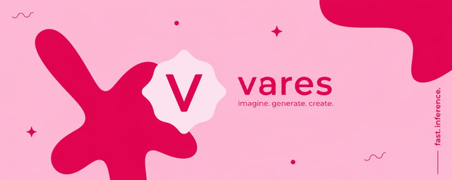

<p align="center">
  
</p>

<p align="center">
  
</p>

<h1 align="center">vares</h1>

<p align="center">
  Imagine. Generate. Create.
</p>

<p align="center">
  <a href="https://github.com/christosantono/vares">
    
  </a>
  <a href="LICENSE">
    
  </a>
  <a href="#">
    
  </a>
  <a href="#">
    
  </a>
  <a href="#">
    
  </a>
</p>

---

## Overview

**vares** is an AI-powered creative platform built for Solana.

It allows anyone to generate images, develop visual concepts, and prepare blockchain-ready assets from a single interface. Whether you're building a meme coin, designing NFT artwork, creating marketing visuals, or simply experimenting with ideas, vares removes the friction between imagination and deployment.

The platform combines high-speed AI generation with native Solana integrations, giving creators a workflow that feels simple while remaining fully decentralized underneath.

---

## Features

- AI image generation powered by **remade.ai**
- Native Solana wallet authentication
- Direct blockchain integration
- Automatic IPFS uploads
- NFT and token metadata generation
- Fast asynchronous generation pipeline
- Modern React interface
- Built for creators, communities, and developers

---

## Architecture

| Layer | Technology | Purpose |
|--------|------------|---------|
| Frontend | React • TypeScript • TailwindCSS | User interface and generation workflow |
| Backend | Node.js • Express | API gateway and generation services |
| AI Engine | remade.ai | Image generation pipeline |
| Storage | IPFS • Pinata | Permanent asset storage |
| Blockchain | Solana | Asset ownership and deployment |

---

## Why vares?

Traditional AI image generators stop after creating an image.

vares continues from there.

Generated content can immediately become part of an on-chain project, allowing creators to move from an idea to a deployable asset without switching between multiple platforms or tools.

---

## Installation

Clone the repository.

```bash
git clone https://github.com/christosantono/vares.git

cd vares
```

Install dependencies.

```bash
npm install
```

Start the development server.

```bash
npm run dev
```

---

## Requirements

- Node.js 18+
- npm or Yarn
- Phantom or another Solana wallet
- Solana CLI (optional)

---

## Roadmap

- Improved generation models
- More Solana launch integrations
- Collaborative workspaces
- Video generation
- Mobile support
- Community templates
- Public API

---

## Tech Stack

- React
- TypeScript
- Node.js
- Express
- Solana Web3.js
- Pinata
- IPFS
- remade.ai

---

## Contributing

Contributions are welcome.

If you have ideas for improvements or want to add new functionality, feel free to open an issue or submit a pull request.

---

## License

Released under the MIT License.
